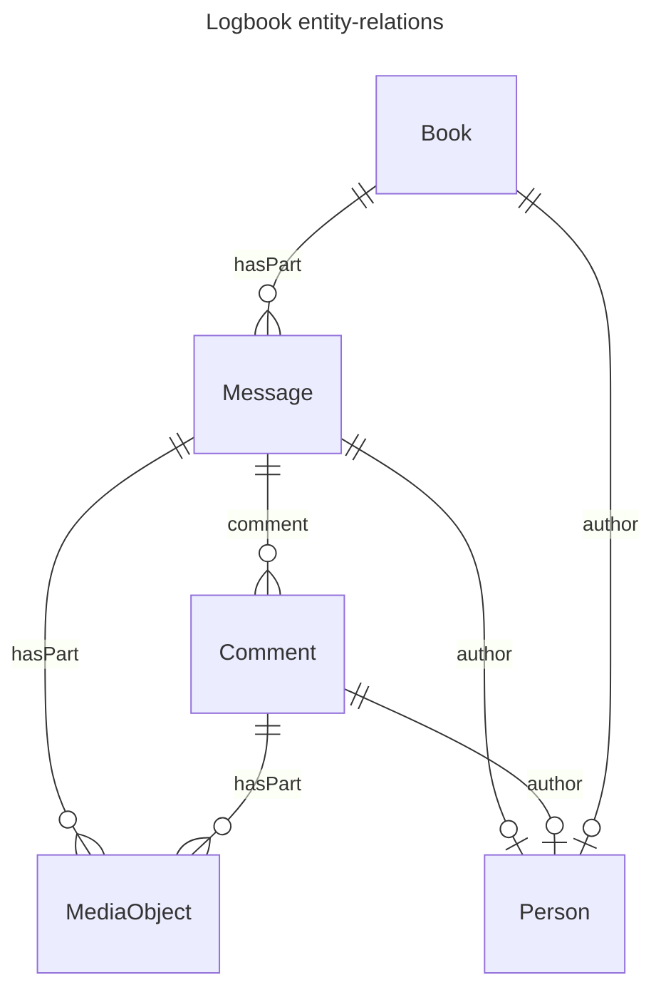

# ELN Conventions

SciLog can export a logbook to an `.eln` archive and re-import such an archive.
Both directions use the format described here.

- Roughly the [ELN File format](https://github.com/TheELNConsortium/TheELNFileFormat/blob/master/SPECIFICATION.md) (in terms of structure of the archive i.e. a zipped RO-Crate with .eln extension)
- Except, more informative types than `Dataset` (e.g. Book, Message, etc), instead of using the `genre` property to distinguish between ELN concepts.
- Possibility to have multiple `@type`s e.g. `[Book, Dataset]`, for best-effort compatibility with the ELN file format

## Structure of a logbook

A logbook is a collection of messages. A message may have several comments. Both messages and comments may have attached files.
We found the following schema.org types appropriate for these entities:

| ELN Concept | schema.org class                              |
| ----------- | --------------------------------------------- |
| Logbook     | [Book](https://schema.org/Book)               |
| Message     | [Message](https://schema.org/Message)         |
| Comment     | [Comment](https://schema.org/Comment)         |
| File        | [MediaObject](https://schema.org/MediaObject) |

We note that all the above types inherit from CreativeWork.

### How are the entities related?

- A Logbook (`Book`) has  `Message`s through the [`hasPart`](https://schema.org/hasPart) property.
- A `Message` has `Comment`s through the [`comment`](https://schema.org/comment) property.
- Messages and Comments have files (i.e. `MediaObject`s) through the [`hasPart`](https://schema.org/hasPart) property. 
(`MediaObject` is aliased to `File` in the [ro-crate context](https://w3id.org/ro/crate/1.2/context))

Visually:

### Properties of the entities

The Logbook is our container type. It has a title, author / creator, description, and create/update timestamps.
We map these to following schema.org properties:

| Logbook property | schema.org property                           |
| ---------------- | --------------------------------------------- |
| created at       | [dateCreated](https://schema.org/dateCreated) |
| title            | [name](https://schema.org/name)               |
| description      | [description](https://schema.org/description) |
| creator/author   | [author](https://schema.org/author)           |

A message and comment have the same properties:

| Message / Comment property | schema.org property                                                |
| -------------------------- | ------------------------------------------------------------------ |
| created at                 | [dateCreated](https://schema.org/dateCreated)                      |
| HTML text content          | [text](https://schema.org/text)                                    |
|                            | [`encodingFormat`](https://schema.org/encodingFormat): `text/html` |
| tags                       | [keywords](https://schema.org/keywords)                              |
| author                     | [author](https://schema.org/author)                                |

An `author` is a schema.org `Person`.

Finally, a File may have the usual [metadata properties](https://github.com/TheELNConsortium/TheELNFileFormat/blob/master/SPECIFICATION.md#example-file) as described in the ELN file format.

### How are attached files included?

Again, we follow the ELN file format - A `Message` or a `Comment` will have an `@id` of a local directory name. As directory nodes in RO-Crate are [required](https://www.researchobject.org/ro-crate/specification/1.2/data-entities.html#directory-data-entity) to be Dataset, we will also have `Dataset` as an additional type in the `@type` array. All the files attached to the message/comment will be placed in the directory, and have local identifiers as well.

## Importing

An archive following the conventions above can be re-imported to recreate the logbook, its messages, comments, and attached files under a chosen location.

- Endpoint: `POST /logbooks/import/eln?location-id=<id>`, a `multipart/form-data` upload with the archive in the `file` field.
- Only archives published by SciLog are accepted. Archives from other ELN tools are rejected (HTTP 422), because their RO-Crate conventions differ enough that a partial mapping could silently corrupt data.
- The archive is validated for structure, RO-Crate metadata, and per-file `sha256` checksums. Failures are returned as a list of errors (HTTP 422) rather than a single message, so all problems surface together.
- Original authorship and timestamps from the archive are preserved as tags on the imported records.
- A partial import is not rolled back automatically; a half-imported logbook can be deleted manually.

For importing from the web UI, see the [User Guide](../Users/Dashboard.md#importing-from-an-eln-archive).

## Example
[example.eln](./example.eln) is a complete example logbook exported as ELN according to the conventions above. It is a ZIP archive — unzip it to inspect its `ro-crate-metadata.json` and the HTML preview (generated by [ro-crate-html](https://www.npmjs.com/package/ro-crate-html)) it contains.
