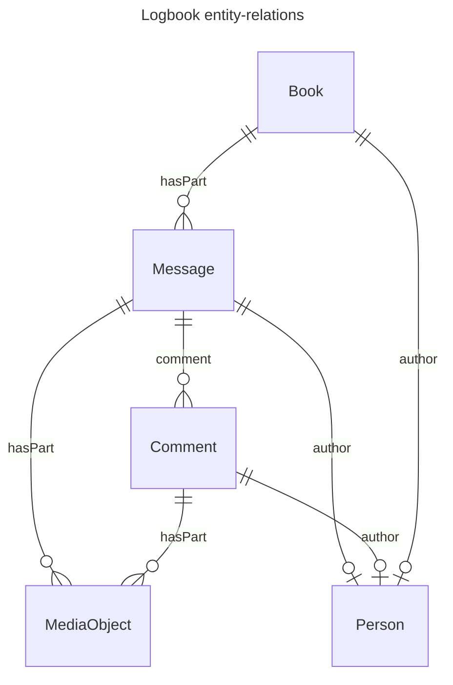

# API-01 ELN conventions

- Roughly the [ELN File format](https://github.com/TheELNConsortium/TheELNFileFormat/blob/master/SPECIFICATION.md) (in terms of structure of the archive i.e. a zipped RO-Crate with .eln extension)
- Except, more informative types than `Dataset` (e.g. Book, Message, etc), instead of using the `genre` property to distinguish between ELN concepts.
- Possibility to have multiple `@type`s e.g. `[Book, Dataset]`, for best-effort compatibility with the ELN file format

## Structure of a logbook

A logbook is a collection of messages. A message may have several comments. Both messages and comments may have attached files.
We found the following schema.org types appropriate for these entities:

| ELN Concept | schema.org class                              |
| ----------- | --------------------------------------------- |
| Logbook     | [Book](https://schema.org/Book)               |
| Message     | [Message](https://schema.org/Message)         |
| Comment     | [Comment](https://schema.org/Comment)         |
| File        | [MediaObject](https://schema.org/MediaObject) |

We note that all the above types inherit from CreativeWork.

### How are the entities related?

- A Logbook (`Book`) has  `Message`s through the [`hasPart`](https://schema.org/hasPart) property.
- A `Message` has `Comment`s through the [`comment`](https://schema.org/comment) property.
- Messages and Comments have files (i.e. `MediaObject`s) through the [`hasPart`](https://schema.org/messageAttachment) property. 
(`MediaObject` is aliased to `File` in the [ro-crate context](https://w3id.org/ro/crate/1.2/context))

Visually:



### Properties of the entities

The Logbook is our container type. It has a title, author / creator, description, and create/update timestamps.
We map these to following schema.org properties:

| Logbook property | schema.org property                             |
| ---------------- | ----------------------------------------------- |
| created at       | [dateCreated](https://schema.org/dateCreated)   |
| updated at       | [dateModified](https://schema.org/dateModified) |
| title            | [name](https://schema.org/name)                 |
| description      | [description](https://schema.org/description)   |
| creator/author   | [author](https://schema.org/author)             |

A message and comment have the same properties:

| Message / Comment property | schema.org property                                                |
| -------------------------- | ------------------------------------------------------------------ |
| created at                 | [dateCreated](https://schema.org/dateCreated)                      |
| updated at                 | [dateModified](https://schema.org/dateModified)                    |
| HTML text content          | [text](https://schema.org/text)                                    |
|                            | [`encodingFormat`](https://schema.org/encodingFormat): `text/html` |
| tags                       | [keywords](https://schema.org/keywords)                              |
| author                     | [author](https://schema.org/author)                                |

An `author` is a schema.org `Person`.

Finally, a File may have the usual [metadata properties](https://github.com/TheELNConsortium/TheELNFileFormat/blob/master/SPECIFICATION.md#example-file) as described in the ELN file format.

### How are attached files included?

Again, we follow the ELN file format - A `Message` or a `Comment` will have an `@id` of a local directory name. As directory nodes in RO-Crate are [required](https://www.researchobject.org/ro-crate/specification/1.2/data-entities.html#directory-data-entity) to be Dataset, we will also have `Dataset` as an additional type in the `@type` array. All the files attached to the message/comment will be placed in the directory, and have local identifiers as well.

## Example
[export - 2025-11-25 10_24_50 GMT+1.eln](./export%20-%202025-11-25%2010_24_50%20GMT+1.eln) contains an example logbook exported as ELN according to the spec above. We also include an HTML preview generated by [ro-crate-html](https://www.npmjs.com/package/ro-crate-html) inside the ELN. The ro-crate-metadata.json file inside the example ELN is also pasted here:
<details>
<summary>Show/hide ro-crate-metadata.json</summary>

```json
{
  "@context": [
    "https://w3id.org/ro/crate/1.2/context",
    {
      "@vocab": "http://schema.org/"
    }
  ],
  "@graph": [
    {
      "@id": "./",
      "@type": "Dataset",
      "name": "test",
      "description": "test logbook on dev-dacat-next",
      "hasPart": [
        {
          "@id": "./68b7047b45f9f4795ee4ea60/"
        }
      ]
    },
    {
      "@id": "ro-crate-metadata.json",
      "@type": "CreativeWork",
      "identifier": "ro-crate-metadata.json",
      "about": {
        "@id": "./"
      },
      "conformsTo": {
        "@id": "https://w3id.org/ro/crate/1.2"
      }
    },
    {
      "@id": "person://oidc-user@facility.com",
      "@type": "Person"
    },
    {
      "@id": "./68b7047b45f9f4795ee4ea60/",
      "@type": [
        "Book",
        "Dataset"
      ],
      "genre": "experiment",
      "name": "SciLog ELN export: test",
      "description": "test logbook on dev-dacat-next",
      "dateCreated": "2025-09-02T14:51:39.916Z",
      "author": {
        "@id": "person://oidc-user@facility.com"
      },
      "hasPart": [
        {
          "@id": "./68b7049445f9f4795ee4ea61/"
        },
        {
          "@id": "./68c40473875fe08fd1a17d9d/"
        },
        {
          "@id": "./68c803d981799be215e2e88e/"
        },
        {
          "@id": "./68c8048281799be215e2e892/"
        },
        {
          "@id": "./68ff7cc20bc2737a2e603c29/"
        },
        {
          "@id": "./6915a689c4faee53f6b1437b/"
        }
      ]
    },
    {
      "@id": "./68b7049445f9f4795ee4ea61/",
      "@type": [
        "Message",
        "Dataset"
      ],
      "name": "Paragraph 68b7049445f9f4795ee4ea61",
      "text": "<p>Oi</p>",
      "dateCreated": "2025-09-02T14:52:04.126Z",
      "keywords": "newmesg",
      "encodingFormat": "text/html",
      "author": {
        "@id": "person://oidc-user@facility.com"
      }
    },
    {
      "@id": "./68c40473875fe08fd1a17d9d/",
      "@type": [
        "Message",
        "Dataset"
      ],
      "name": "Paragraph 68c40473875fe08fd1a17d9d",
      "text": "<p>Let's add some <strong>rich</strong> text here with bunch of <i>formatting.</i><br>Let's add a table even:<br>&nbsp;</p><figure class=\"table\"><table><tbody><tr><td>abc</td><td>efg</td><td>hij</td></tr><tr><td>123</td><td>456</td><td>789</td></tr><tr><td>321</td><td>654</td><td>987</td></tr></tbody></table></figure><p>And now an image:</p><figure class=\"image image_resized\"></figure>",
      "dateCreated": "2025-09-12T11:30:59.631Z",
      "keywords": "newmesg,acomment,secondcomment",
      "encodingFormat": "text/html",
      "author": {
        "@id": "person://oidc-user@facility.com"
      },
      "hasPart": [
        {
          "@id": "./68c40473875fe08fd1a17d9d/68c409c1bc32d2e650a9978c.png"
        }
      ],
      "comment": [
        {
          "@id": "./68c803c181799be215e2e88d/"
        },
        {
          "@id": "./68c8046981799be215e2e891/"
        }
      ]
    },
    {
      "@id": "./68c40473875fe08fd1a17d9d/68c409c1bc32d2e650a9978c.png",
      "@type": "File",
      "encodingFormat": "image/png"
    },
    {
      "@id": "./68c803c181799be215e2e88d/",
      "@type": [
        "Comment",
        "Dataset"
      ],
      "name": "Comment 68c803c181799be215e2e88d",
      "text": "<p>Nice graphic, dude!</p>",
      "dateCreated": "2025-09-15T12:17:05.358Z",
      "keywords": "acomment",
      "encodingFormat": "text/html",
      "parentItem": {
        "@id": "./68c40473875fe08fd1a17d9d/"
      },
      "author": {
        "@id": "person://oidc-user@facility.com"
      }
    },
    {
      "@id": "./68c8046981799be215e2e891/",
      "@type": [
        "Comment",
        "Dataset"
      ],
      "name": "Comment 68c8046981799be215e2e891",
      "text": "<p>a further comment</p>",
      "dateCreated": "2025-09-15T12:19:53.956Z",
      "keywords": "acomment,secondcomment",
      "encodingFormat": "text/html",
      "parentItem": {
        "@id": "./68c40473875fe08fd1a17d9d/"
      },
      "author": {
        "@id": "person://oidc-user@facility.com"
      }
    },
    {
      "@id": "./68c803d981799be215e2e88e/",
      "@type": [
        "Message",
        "Dataset"
      ],
      "name": "Paragraph 68c803d981799be215e2e88e",
      "text": "<p>Oii mate</p>",
      "dateCreated": "2025-09-15T12:17:29.944Z",
      "keywords": "areply",
      "encodingFormat": "text/html",
      "author": {
        "@id": "person://oidc-user@facility.com"
      }
    },
    {
      "@id": "./68c8048281799be215e2e892/",
      "@type": [
        "Message",
        "Dataset"
      ],
      "name": "Paragraph 68c8048281799be215e2e892",
      "text": "<p>wassup</p>",
      "dateCreated": "2025-09-15T12:20:18.297Z",
      "keywords": "",
      "encodingFormat": "text/html",
      "author": {
        "@id": "person://oidc-user@facility.com"
      }
    },
    {
      "@id": "person://account1@account1",
      "@type": "Person"
    },
    {
      "@id": "./68ff7cc20bc2737a2e603c29/",
      "@type": [
        "Message",
        "Dataset"
      ],
      "name": "Paragraph 68ff7cc20bc2737a2e603c29",
      "text": "<p>message</p>",
      "dateCreated": "2025-10-27T14:08:02.554Z",
      "keywords": "tags1,tag3",
      "encodingFormat": "text/html",
      "author": {
        "@id": "person://account1@account1"
      }
    },
    {
      "@id": "./6915a689c4faee53f6b1437b/",
      "@type": [
        "Message",
        "Dataset"
      ],
      "name": "Paragraph 6915a689c4faee53f6b1437b",
      "text": "<p><a class=\"fileLink\" target=\"_blank\" href=\"./6915a689c4faee53f6b1437b/6915a688945a3953740eb971.pdf\">02 Introduction.pdf</a>a pdf attachment and an image too:<br></p>",
      "dateCreated": "2025-11-13T09:36:09.034Z",
      "keywords": "",
      "encodingFormat": "text/html",
      "author": {
        "@id": "person://account1@account1"
      },
      "hasPart": [
        {
          "@id": "./6915a689c4faee53f6b1437b/6915a688945a3953740eb96f.png"
        },
        {
          "@id": "./6915a689c4faee53f6b1437b/6915a688945a3953740eb971.pdf"
        }
      ]
    },
    {
      "@id": "./6915a689c4faee53f6b1437b/6915a688945a3953740eb96f.png",
      "@type": "File",
      "encodingFormat": "image/png"
    },
    {
      "@id": "./6915a689c4faee53f6b1437b/6915a688945a3953740eb971.pdf",
      "@type": "File",
      "encodingFormat": "application/pdf"
    }
  ]
}
```

</details>

