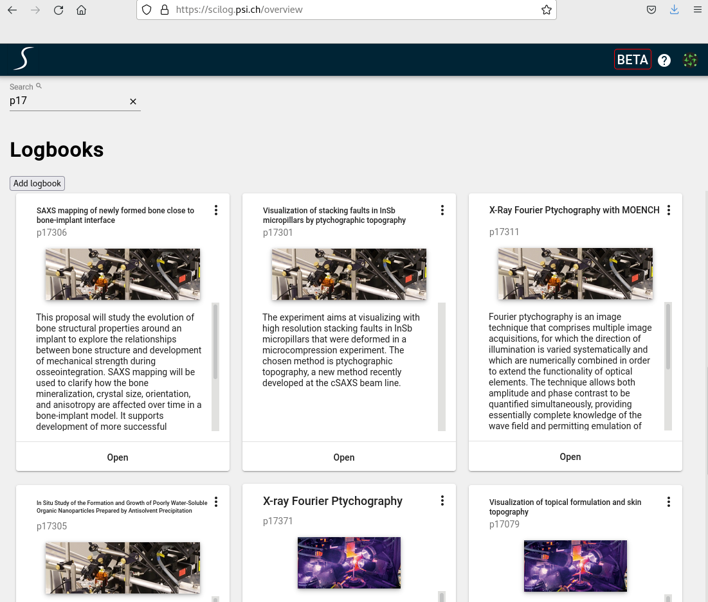

## Dashboard

The dashboard is the first page that you see after being logged in. It contains an overview of all logbooks that you have access to.

## Searching

You can search among the logbooks based on the ownerGroup or the text content of the abstracts

## View Details

To navigate to a specific logbook just click on the image or the open button of the corresponding logbook card.

## Adding a logbook

Use the **Add logbook** control at the top of the dashboard:

- **New logbook** creates an empty logbook, where you enter the title, location, owner group, and so on.
- **Import from .eln** creates a logbook from a previously exported `.eln` archive.

### Importing from an `.eln` archive

Select **Add logbook ▾ → Import from .eln**, then in the dialog:

1. Choose the `.eln` file — drag it onto the drop area, or click to browse.
2. Select the target **location** (beamline or instrument).
3. Click **Import**.

On success you are taken straight to the newly created logbook. Only `.eln` archives previously exported by SciLog are accepted (up to 100 MB); if an archive cannot be imported, the dialog lists the reasons so you can correct it.

