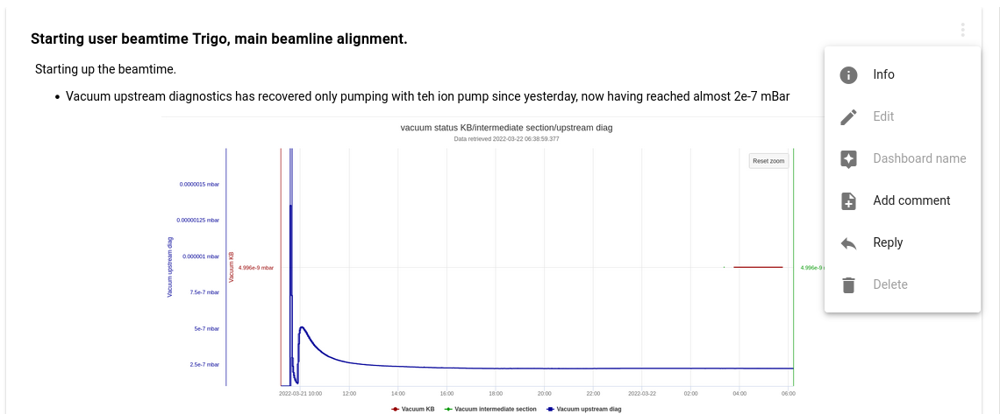

# Adding, Displaying and Searching contents

## Display View options
The following screenshot illustrates the standard *dashboard* view for an electronic logbook  which consists of a logbook widget on the right and a task/todo widget on the left.

You can switch to a view where a single widget takes all the screen space by using the navigation buttons to the left. For example the resulting view  for a logboook widget would be 

You can always switch back to the *dashboard* like view with the 2nd top most button in the navigation bar to the left.

Via the configuration dialog of the logbook (top right corner) you can also configure, whether you want to see the logbook entries in normal or reverse chronological order and if timestamp infos should be added or not.

## Adding and editing entries

You add entries via the WYSIWYG editor on the bottom of the logbook widget. This includes options for adding tables, images and more. 

You can also add tags to each new entry in the tag line below the edit window. Please separate the individual tags by a space character (also needed for the first tag). The selected tags will automatically apply to all future entries, until you decide to delete them again.

An entry is actually added to the logbook by either clicking the send icon (triangle) in the right bottom corner or by hitting ctrl-enter. After saving the entry in this way it appears in the upper logbook view. 

With the *three-dot* menu on the right of entries you can decide to edit, comment or delete existing entries.

Please note that editing entries will be permitted only for a certain pre-defined time , the default being 3 days. After that time the entries can no longer be modified. In the screenshot above this period has passed, therefore the edit functionality is greyed out.

There are keyboard shortcuts defined, a description of which you get via the help icon on the top right:

## Multi User Behaviour

It may well be that several people make entries to the same logbook at the same time. The view is always kept up-to-date automatically with entries from all participants.

## Searching contents
Use the text entry field on the top center to start a search. The search syntax is explained via examples. The search results are displayed within the serach popup dialog . 

The search happens only within the current logbook. Via the *:global* flag the search extended to all logbooks for which one has read access.

## Defining Virtual Logbooks (inject data)
Usually you see only data connected to a single logbook. However you can *inject* information from *other* logbooks to your current logbook via the logbook configuration button. In particular you can select a set from your other logbooks under the item *Filter Settings* from a drop down list. Then all information *snippets* from the other logbooks will be added to your current logbook in proper chronological order. In addition you can define a set of tags. Then only those snippets, which have all the corresponding tags set, are added to your logbook. 

Please note, that any change you apply to such injected snippets are made also in the original logbook, from where the snippets were added originally. The reason for this behaviour is, that no copies of the snippet data are produced, but just the original snippet instances are made visible (and editable) in your current logbook.

