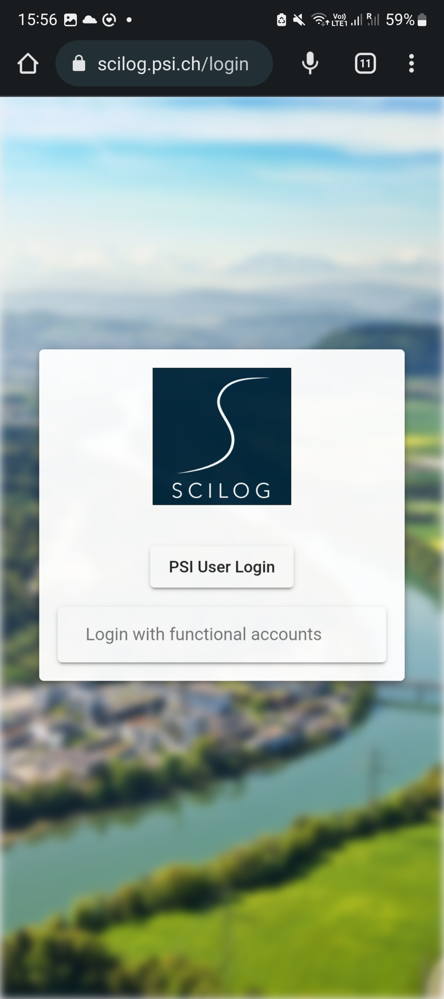
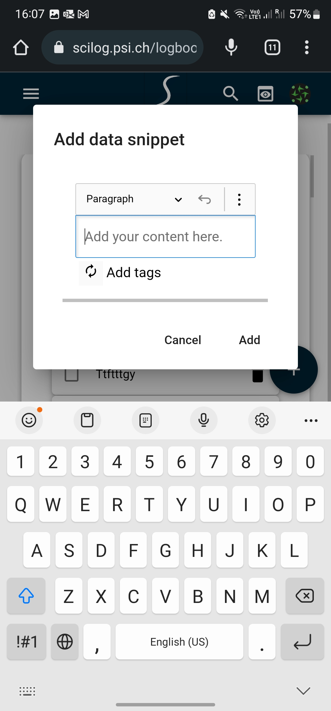

# Smartphone usage

The GUI web application can as well be used on the smartphone or a tablet computer by using any browser and navigating to the starting page of the application.
This option is especially useful if you want to quickly add photos (e.g. images of your experimental setup) to the electronic logbook.

## Login

## Dashboard

## Text Edit

## Adding photos

